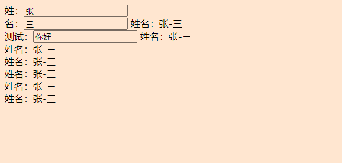
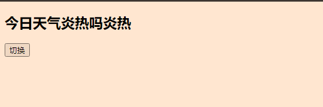

# Vue学习笔记

## 第1章：Vue 核心

### 1.1. Vue 简介

#### 	1.1.1. 官网

1. 英文官网: https://vuejs.org/
2. 中文官网: https://cn.vuejs.org/

#### 	1.1.2. 介绍与描述

1. 动态构建用户界面的渐进式JavaScript 框架
2. 作者: 尤雨溪

#### 	1.1.3. Vue 的特点

1. 遵循MVVM 模式
2. 编码简洁, 体积小, 运行效率高, 适合移动/PC 端开发
3. 它本身只关注UI, 也可以引入其它第三方库开发项目

#### 	1.1.4. 与其它JS 框架的关联

1. 借鉴Angular 的模板和数据绑定技术
2. 借鉴React 的组件化和虚拟DOM 技术

#### 	1.1.5. Vue 周边库

1. vue-cli: vue 脚手架
2. vue-resource
3. axios
4. vue-router: 路由
5. vuex: 状态管理
6. element-ui: 基于vue 的UI 组件库(PC 端)
    ……

## 第2章：初识Vue

### 2.1模板语法

Vue模板语法有2大类：

#### 	1.插值语法：

​		功能：用于解析标签体内容。
​		写法：{{xxx}}，xxx是js表达式，且可以直接读取到data中的所有属性。

#### 	2.指令语法：

​		功能：用于解析标签（包括：标签属性、标签体内容、绑定事件.....）。
​		举例：v-bind:href="xxx" 或  简写为 :href="xxx"，xxx同样要写js表达式， 且可以直接读取到data中的所有属性。
​		备注：Vue中有很多的指令，且形式都是：v-????，此处我们只是拿v-bind举个例子。

```html
<!DOCTYPE html>
<html>
	<head>
		<meta charset="UTF-8" />
		<title>模板语法</title>
		<!-- 引入Vue -->
		<script type="text/javascript" src="../js/vue.js"></script>
	</head>
	<body>
		<!-- 准备好一个容器-->
		<div id="root">
			<h1>插值语法</h1>
			<h3>你好，{{name}}</h3>
			<hr/>
			<h1>指令语法</h1>
			<a v-bind:href="school.url.toUpperCase()" x="hello">点我去{{school.name}}学习1</a>
			<a :href="school.url" x="hello">点我去{{school.name}}学习2</a>
		</div>
	</body>

	<script type="text/javascript">
		Vue.config.productionTip = false //阻止 vue 在启动时生成生产提示。

		new Vue({
			el:'#root',
			data:{
				name:'jack',
				school:{
					name:'尚硅谷',
					url:'http://www.atguigu.com',
				}
			}
		})
	</script>
</html>
```


### 2.2Vue的插值语法

> 1. 功能: 用于解析标签体内容
> 2. 语法: {{xxx}} ，xxxx 会作为js 表达式解析

  1.想让Vue工作，就必须创建一个Vue实例，且要传入一个配置对象：

  2.root容器里的代码依然符合html规范，只不过混入了一些特殊的Vue语法：

  3.root容器里的代码被称为[Vue模板]： 

  4.容器与实例只存在一对一的关系。

  5.真是开发中只有一个Vue实例，并会配合着组建一开始用。

  6.{{* * * * * }}中的*，填写js表达式，且*可以读取到data中的所有属性

  7.一旦data中的数值发生改变，那么模板中用到该数据的地方会自动更新

```html
<!DOCTYPE html>
<html lang="en">
<head>
    <meta charset="UTF-8">
    <meta http-equiv="X-UA-Compatible" content="IE=edge">
    <meta name="viewport" content="width=device-width, initial-scale=1.0">
    <title>初识</title>
    <script type="text/javascript" src="../js/vue.js"></script>
</head>
<body>
    <!-- 
    初识Vue:
    1,想让Vue工作，就必须创建一个Vue实例，且要传入一个配置对象：
    2.root容器里的代码依然符合html规范，只不过混入了一些特殊的Vue语法：
    3.root容器里的代码被称为[Vue模板]： 
    4.容器与实例只存在一对一的关系。
    5.真是开发中只有一个Vue实例，并会配合着组建一开始用。
    6.{{***}}中的***，填写js表达式，且***可以读取到data中的所有属性
    7.一旦data中的数值发生改变，那么模板中用到该数据的地方会自动更新
    
-->

    <!-- 容器与实例只存在一对一的关系。 -->
    <div id="root">
        <!-- 插值语法 -->
        <h1>Hello，{{name}}
           
        </h1>
    </div>
    <div class="root2">
        <!-- 插值语法 -->
        <h1>Hello，{{name}} ，{{address}}</h1>
    </div>
    <h2>{{name}}</h2>
    <script type="text/javascript">
        Vue.config.productionTip=false
        //以阻止 vue 在启动时生成生产提示。
        //创建Vue实例
        const x = new Vue({
            el:'#root',//用于指定当前Vue实例为哪一个容器服务，值通常为css样式选择器
            data:{
                //data中用于存储数据，数据供el所制定的容器使用，值我们暂时先写成一个对象。
                name:'尚硅谷123'
            }
        })
        new Vue({
            el:'.root2',//用于指定当前Vue实例为哪一个容器服务，值通常为css样式选择器
            data:{
                //data中用于存储数据，数据供el所制定的容器使用，值我们暂时先写成一个对象。
                address:'北京'
            }
        })
    </script>
</body>
</html>
```

> # Hello，尚硅谷123
>
> # Hello， ，北京
>
> ## {{name}}


### 2.3. 指令语法

> 1. 功能: 解析标签属性、解析标签体内容、绑定事件
> 2. 举例：v-bind:href = 'xxxx' ，xxxx 会作为js 表达式被解析
> 3. 说明：Vue 中有有很多的指令，此处只是用v-bind 举个例子

## 第3章：模板语法

### 3.1Vue的数据绑定

Vue中有2种数据绑定的方式：
    **1,单向绑定(v-bind):数据只能从data流向页面。**
    **2,双向绑定(v-model):数据不仅能从data流向页面，还可以从页面流向data.**
    备注：
    1,双向绑定一般都应用在表单类元素上(如:input、select等)
    2.-mode1:value可以简写为v-model,因为v-mode1默认收集的就是value值。

```html
<!DOCTYPE html>
<html lang="en">
<head>
    <meta charset="UTF-8">
    <meta http-equiv="X-UA-Compatible" content="IE=edge">
    <meta name="viewport" content="width=device-width, initial-scale=1.0">
    <title>Document</title>
    <script type="text/javascript" src="../js/vue.js"></script>
</head>
<body>
    <!-- Vue中有2种数据绑定的方式：
    1,单向绑定(v-bind):数据只能从data流向页面。
    2,双向绑定(v-model):数据不仅能从data流向页面，还可以从页面流向data.
    备注：
    1,双向绑定一般都应用在表单类元素上(如l:input、select等)
    2.-mode1:value可以简写为v-model,因为v-mode1默认收集的就是value值。 -->
    <div id="root">
        单项数据绑定：<input type="text" v-bind:value="name">
    <br/>
        双项数据绑定：<input type="text" v-model:value="name">
    <br/>
    <h2 v-model:x="name">你好啊</h2>
    </div>
    <script type="text/javascript" >
    Vue.config.productionTip=false;
    new Vue({
        el:'#root',
        data:{
            name:'尚硅谷123'
        }
    })
    
    </script>
</body>
</html>
```

<!DOCTYPE html>
<html lang="en">
<head>
    <meta charset="UTF-8">
    <meta http-equiv="X-UA-Compatible" content="IE=edge">
    <meta name="viewport" content="width=device-width, initial-scale=1.0">
    <title>Document</title>
    <script type="text/javascript" src="../js/vue.js"></script>
</head>
<body>
    <!-- Vue中有2种数据绑定的方式：
    1,单向绑定(v-bind):数据只能从data流向项面。
    2,双向你定(v-model):数据不仅能从data流向项面，还可以从项面流向data.
    备注：
    1,双向你定一般都应用在表单类元素上(如l:input、select等)
    2.-mode1:value可以简写为v-model,因为v-mode1默认收集的就是value值。 -->
    <div id="root">
        单项数据绑定：<input type="text" v-bind:value="name">
    <br/>
        双项数据绑定：<input type="text" v-model:value="name">
    <br/>
    <h2 v-model:x="name">你好啊</h2>
    </div>
    <script type="text/javascript" >
    Vue.config.productionTip=false;
    new Vue({
        el:'#root',
        data:{
            name:'尚硅谷123'
        }
    })
    </script>
</body>
</html>


## 第4章：el与data的两种写法

### 2.6el与data的两种写法

data与el的两种写法
    1.el有2种写法
        (1).new Vue时候配置el属性。
        (2).先创建Vue实例，随后再通过vm.$mount('#root')指定el的值。
    2.data有2种写法
        (1).对象式
        (2).函数式
    如何选择：目前哪种写法都可以，以后学习到组件时，data必须使用函数式，否则会报错。
    3.一个重要的原则：
    由Vue管理的函数，一定不要写箭头函数，一且写了箭头函数，this就不再是Vue实例了。 

```html
<!DOCTYPE html>
<html lang="en">
<head>
    <meta charset="UTF-8">
    <meta http-equiv="X-UA-Compatible" content="IE=edge">
    <meta name="viewport" content="width=device-width, initial-scale=1.0">
    <title>Document</title>
    <script src="../js/vue.js" type="text/javascript"></script>
</head>
<body>
    <div id="root">
        <h1>你好，{{name}}</h1>
    </div>
</body>
<script type="text/javascript">
    Vue.config.productionTip=false
    const v =new Vue({
        el:'#root',
        // data的第一种写法：对象式子
        // data:{
        //     name:'尚硅谷'
        // }
        //data的第二种写法：函数式
        data:function(){
            console.log('@@@',this)
            //此处的this是vue实例对象，若用this.不得用data()=>{}函数

            return{ 
            name:'尚硅谷'
            }
        }
        })
</script>
</html>
```


## 第5章MVVM 模型

### 5.1MVVM 模型

1. **M：模型(Model) ：对应data 中的数据**
2. **V：视图(View) ：模板**
3. **VM：视图模型(ViewModel) ： Vue 实例对象**


```html
<!DOCTYPE html>
<html lang="en">
<head>
    <meta charset="UTF-8">
    <meta http-equiv="X-UA-Compatible" content="IE=edge">
    <meta name="viewport" content="width=device-width, initial-scale=1.0">
    <title>Document</title>
    <script src="./js/vue.js"></script>
</head>
<body>
    <div id="root">
        <h1>学校名称：{{name}}</h1>
        <h1>学校地址：{{address}}</h1>
        <h1>测试地址1：{{1+1}}</h1>
        <h1>测试地址2: {{$options}}</h1>
        <h1>测试地址3: {{$emit}}</h1>
        <h1>测试地址4: {{_c}}</h1>
    </div>
</body>
<script type="text/javascript">
    Vue.config.productionTip=false
    const vm =new Vue({
        el:"#root",
        data:{
            name:'尚硅谷',
            address:'上海'
    }
    })
    console.log(vm)
</script>
</html>
```


## 第6章：数据代理

### 6.1数据代理

####  Object.defineProperty(）

```html
<!DOCTYPE html>
<html lang="en">
<head>
    <meta charset="UTF-8">
    <meta http-equiv="X-UA-Compatible" content="IE=edge">
    <meta name="viewport" content="width=device-width, initial-scale=1.0">
    <title>Document</title>
    <script src="../js/vue.js"></script>
</head>
<body>
     <script type="text/javascript">
    Vue.config.productionTip = false        
   let num=18
   let person={
       name:'张三',
       sex:'男',
       Object.defineProperty(person,'age',{
       value:128,
    //    控制台person==>{name: '张三', sex: '男', age: 128}
        enumerable:true,//控制属性是否可以枚举
        writable:true,//控制属性是否可以被修改,默认值是false
        configurable:true, //控制属性是否可以被删除,默认值false
        })

    </script>
</body>
</html>
```


```html
<!DOCTYPE html>
<html lang="en">

<head>
    <meta charset="UTF-8">
    <meta http-equiv="X-UA-Compatible" content="IE=edge">
    <meta name="viewport" content="width=device-width, initial-scale=1.0">
    <title>Document</title>
    <script src="../js/vue.js"></script>
</head>

<body>
    <!-- 
    1,Vue中的数据代理：
    通过vm对象米代理data对象中属性的操作(读/写)
    2,Vue中数据代理的好处：
    更加方便的操作data中的数据
    3,基木原理：
    通过Object,defineProperty（）把data对象中所有属性添加到vm上，
    为每一个添加到vm上的属性，都指定一个getter/setter,
    在getter/setter内部去操作(读/写)data中对应的属性。 -->

    <script type="text/javascript">
        Vue.config.productionTip = false
        let age = 18
        let person = {
            name: '张三',
            sex: '男',
            //    age:18
        }
        //传3个参数
        Object.defineProperty(person, 'age', {
            //当有人读取person的age属性，get函数（getter）就会被调用，且返回值就是age的值
            get() {
                console.log('有人读取了age属性')
                return age
            },
            //当有人修改了age属性时，set函数（setter）就会被调用，切回收到修改的具体指
            set(value) {
                console.log('有人读取了age属性', value);
                age = value
            }
        })

    </script>
</body>

</html>
```

### 6.2Vue中数据代理

 1,Vue中的数据代理：

  通过一个对象代理对另一个对象中的属性操作(读/写)。

```html
<!DOCTYPE html>
<html lang="en">
<head>
    <meta charset="UTF-8">
    <meta http-equiv="X-UA-Compatible" content="IE=edge">
    <meta name="viewport" content="width=device-width, initial-scale=1.0">
    <title>Document</title>
    <script src="../js/vue.js"></script>
</head>
<body>
    <!-- 数据代理：通过一个对象代理对另一个对象中的属性操作 (读和写)-->
    <script type="text/javascript">
        Vue.config.productionTip = false
        let obj={x:100}
        let obj2={y:200}
        //通过obj2访问x
        Object.defineProperty(obj2,'x',{
            get(){
                return obj.x
            },
            set(value){
                obj.x=value
            }
        })
    </script>
</body>
</html>
```


  2,Vue中数据代理的好处：

  更加方便的操作data中的数据

  3,基木原理：

  通过Object,defineProperty（）把data对象中所有属性添加到vm上，

  为每一个添加到vm上的（性，都指定一个getter/setter,

  在getter/setter内部去操作(读/写)data中对应的属性。

```html

```


## 第7章：事件处理

### 7.1事件的基本使用

```html
<!DOCTYPE html>
<html lang="en">
<head>
    <meta charset="UTF-8">
    <meta http-equiv="X-UA-Compatible" content="IE=edge">
    <meta name="viewport" content="width=device-width, initial-scale=1.0">
    <title>Document</title>
    <script src="../js/vue.js" type="text/javascript"></script>
</head>
<body>
    <div id="root">
        <h2>欢迎来到{{name}}学习</h2>
        <!-- <button v-on:click="showInfo">点我提示信息</button> -->
        <!-- <button @click="showInfo">点我提示信息</button> -->
        <button @click="showInfo1">点我提示信息1</button>
        <!-- <button @click="showInfo2(66,$event)">点我提示信息2</button> -->
        <button @click="showInfo2($event,66)">点我提示信息2</button>
    </div>
    <script type="text/javascript">
        Vue.config.productionTip=false
        
       const vm= new Vue({
            el:'#root',
            data:{
                name:'尚硅谷'
                ,showInfo2(a,b,c,number){
                    // alert('同学你好!!')
                    console.log(a,b,c,number)
                    // console.log(this==vm)//此处的this是vm
                }
            },
            methods:{
                showInfo1(event){
                    alert('同学你好!')
                    // console.log(a,b,c,d)
                    // console.log(this==vm)//此处的this是vm
                }
                // ,showInfo2(number,a,b,c){
                //     // alert('同学你好!!')
                //     console.log(number,a,b,c)
                //     // console.log(this==vm)//此处的this是vm
                // }
                
            }

        })
    </script>
</body>
</html>
```


### 7.2数据修饰符

​	Vue中的事件修饰符：

​    1,prevent:阻止默认事件（常用）：

​    2.stop:阻止事件冒泡（常用）：

​    3.once:事件只触发一次（常用）：

​    4,capture:使用事件的捕获模式：

​    5,self:只有event,target是当前操作的元素时才触发事件：

​    6,passive:事件的默认行为立即执行，无需等待事件回调执行完毕： 

```html
<!DOCTYPE html>
<html lang="en">

<head>
    <meta charset="UTF-8">
    <meta http-equiv="X-UA-Compatible" content="IE=edge">
    <meta name="viewport" content="width=device-width, initial-scale=1.0">
    <title>Document</title>
    <script src="../js/vue.js" type="text/javascript"></script>
    <style>
        *{
            margin-top: 50px;
        }
        .demo1 {
            height: 50px;
            background-color: aquamarine;
        }
        .box1{
            padding: 5px;
            background-color: skyblue;
        }
        .box2{
            padding: 5px;
            background-color: blueviolet;
        }
        .list{
            width:200px;
            height: 20px;
            background-color: darkorange;
            overflow: auto;
        }
        li{
            height: 200px;
        }
    </style>
</head>
<body>
    <div id="root">
        <h2>欢迎来到{{name}}学习</h2>
        <!-- 1,prevent:阻止默认事件（常用）： -->
        <a href="http://www.atguigu.com" @click.prevent="showInfo">点我提示信息</a>
        <!-- 2.stop:阻止事件冒泡（常用）： -->
        <div class="demo1" @click="" showInfo>
            <button @click.stop="showInfo">点我提示信息</button>
        </div>
        <!-- 3.once:事件只触发一次（常用）： -->
        <div>
            <button @click.once="showInfo">点我提示信息</button>
        </div>
        <!-- 4,capture:使用事件的捕获模式： -->
        <div class="box1" @click="showMsg(1)">
            div1
            <div class="box2" @click="showMsg(2)">
                div2
            </div>
        </div>
        <!-- 5,self:只有event,target是当前操作的元素时才触发事件： -->
        <div class="demo1" @click.self="showInfo">
            <button @click="showInfo">点击提示信息</button>
        </div>
        <!-- 6,passive:事件的默认行为立即执行，无需等待事件回调执行完毕：  -->
        <ul @wheel="demo" class="list">
            <li>1</li>
            <li>2</li>
            <li>3</li>
            <li>4</li>
        </ul>
    </div>
    <script type="text/javascript">
        Vue.config.productionTip = false
        new Vue({
            el:"#root",
            data: {
                name: '尚硅谷'
            },
            methods:{
                showInfo(e){
                    // e.stopPropagation()
                    // alert('同学你好！')
                    console.log(e.target)
                },
                showMsg(msg){
                    console.log(msg)
                }
            }
        }) 
    </script>
</body>
</html>
```


### 7.3键盘事件

```html
<!DOCTYPE html>
<html lang="en">
<head>
    <meta charset="UTF-8">
    <meta http-equiv="X-UA-Compatible" content="IE=edge">
    <meta name="viewport" content="width=device-width, initial-scale=1.0">
    <title>Document</title>
    <script src="../js/vue.js" type="text/javascript"></script>
</head>
<body>
    <!-- 准备好一个容器 -->
    <div id="root">
        <h2>欢迎来到{{name}}学习</h2>
        <input type="text" placeholder="按下回车键提示输入"@keyup.enter="showInfo">
    </div>
    <script type="text/javascript">
        Vue.config.productionTip=false//阻止vue启动时生成生产提示
        new Vue({
            el:'#root',
            data:{
                name:'尚硅谷'
            },
            methods:{
                showInfo(e){
                    if(e.keyCode !==13) return 
                    // console.log(e.keyCode)
                    console.log(e.target.value)
                }
            }
        })
    </script>
</body>
</html>
```

## 第8章：计算属性

### 8.1姓名案例_增值语法实现 

```html
<!DOCTYPE html>
<html lang="en">
<head>
    <meta charset="UTF-8">
    <meta http-equiv="X-UA-Compatible" content="IE=edge">
    <meta name="viewport" content="width=device-width, initial-scale=1.0">
    <title>姓名案例</title>
    <script src="../js/vue.js" type="text/javascript"></script>
</head>
<body>
    <div id="root">
        姓：<input type="text" v-model:value="firstName"><br>
        名：<input type="text" v-model:value="lastName">
        姓名：<span>{{firstName+'-'+lastName}}</span>
        姓名：<span>{{firstName.slice(0,3)}}-{{lastName}}</span>
        <!-- slice(0,3)我们要第零位到第三位 -->
    </div>
    <script type="text/javascript">
        Vue.config.productionTip=false
        new Vue({
            el:'#root',
            data:{
                firstName:'张',
                lastName:'三'
            }
        })
    </script>
</body>
</html>
```


### 8.2姓名案例_methods实现

```html
<!DOCTYPE html>
<html lang="en">
<head>
    <meta charset="UTF-8">
    <meta http-equiv="X-UA-Compatible" content="IE=edge">
    <meta name="viewport" content="width=device-width, initial-scale=1.0">
    <title>姓名案例</title>
    <script src="../js/vue.js" type="text/javascript"></script>
</head>
<body>
    <div id="root">
        姓：<input type="text" v-model:value="firstName"><br>
        名：<input type="text" v-model:value="lastName">
        姓名：<span>{{firstName+'-'+lastName}}</span>
        姓名：<span>{{fullName()}}</span>
        <br/>
        <!-- slice(0,3)我们要第零位到第三位 -->
        <!-- <button @click="fullName()">点击</button> -->
    </div>
    <script type="text/javascript">
        Vue.config.productionTip=false
        new Vue({
            el:'#root',
            data:{
                firstName:'张',
                lastName:'三'
            },methods:{
                fullName(){
                    // console.log('@',this)
                    return this.firstName+'-'+this.lastName
                }
            }
        })
    </script>
</body>
</html>
```


### 8.3姓名案例_计算属性实现 

```html
<!DOCTYPE html>
<html lang="en">
<head>
    <meta charset="UTF-8">
    <meta http-equiv="X-UA-Compatible" content="IE=edge">
    <meta name="viewport" content="width=device-width, initial-scale=1.0">
    <title>姓名案例</title>
    <script src="../js/vue.js" type="text/javascript"></script>
</head>
<body>
    <div id="root">
        姓：<input type="text" v-model:value="firstName"><br>
        名：<input type="text" v-model:value="lastName">
        姓名：<span>{{firstName+'-'+lastName}}</span><br>
        测试：<input type="text" v-model="x">
        姓名：<span>{{fullName}}</span><br>
        姓名：<span>{{fullName}}</span><br>
        姓名：<span>{{fullName}}</span><br>
        姓名：<span>{{fullName}}</span><br>
        姓名：<span>{{fullName}}</span><br>
        姓名：<span>{{fullName}}</span>
        <br/>
        
    </div>
    <script type="text/javascript">
        Vue.config.productionTip=false
        const vm = new Vue({
            el:'#root',
            data:{
                firstName:'张',
                lastName:'三',
                x:'你好'
            },
            computed:{
                fullName:{
                    // get有什么作用？
                    // 当有人调用fullname时，get就会被调用，且返回值作为fullname的值
                    // get什么时候调用？1.初次读取fullName时。 2.所依赖的数据发生变化时
                    get(){
                        console.log('get被调用')
                        // return '小猪佩奇'
                        console.log(this)

                        return this.firstName+'-'+this.lastName
                        // 2.所依赖的数据发生变化时
                    },
                    // set什么时候会被调用？当fullName被修改时。
                    set(value){
                        // console.log('set',value)
                        // 张-三
                        // 李-四
                        const arr=value.split('-')
                        //拆分成数组
                        this.firstName=arr[0]
                        this.lastName=arr[1]
                    }
                }
            }
        })
    </script>
</body>
</html>
```




### 8.4姓名案例_计算属性简写实现

```html
<!DOCTYPE html>
<html lang="en">
<head>
    <meta charset="UTF-8">
    <meta http-equiv="X-UA-Compatible" content="IE=edge">
    <meta name="viewport" content="width=device-width, initial-scale=1.0">
    <title>姓名案例</title>
    <script src="../js/vue.js" type="text/javascript"></script>
</head>
<body>
    <div id="root">
        姓：<input type="text" v-model:value="firstName"><br>
        名：<input type="text" v-model:value="lastName">
        姓名：<span>{{firstName+'-'+lastName}}</span><br>
        测试：<input type="text" v-model="x">
        姓名：<span>{{fullName}}</span><br>
        
        <br/>
        
    </div>
    <script type="text/javascript">
        Vue.config.productionTip=false
        const vm = new Vue({
            el:'#root',
            data:{
                firstName:'张',
                lastName:'三',
                x:'你好'
            },
            computed:{
                 //    完整写法
                // fullName:{
                //     get(){
                //         console.log('get被调用')
                //         return this.firstName+'-'+this.lastName
                //     },
                //     set(value){
                //         const arr=value.split('-')
                //         this.firstName=arr[0]
                //         this.lastName=arr[1]
                //     }}
                // 简写
                fullName(){
                   console.log('get被调用了') 
                   return this.firstName+'-'+this.lastName
                }
            }
        })
    </script>
</body>
</html>
```


## 第9章：监视属性

### 9.1天气案例

```html
<!DOCTYPE html>
<html lang="en">
<head>
    <meta charset="UTF-8">
    <meta http-equiv="X-UA-Compatible" content="IE=edge">
    <meta name="viewport" content="width=device-width, initial-scale=1.0">
    <title>Document</title>
    <script src="../js/vue.js" type="text/javascript"></script>
</head>
<body>
    <div id="root">
        <h2>今日天气炎热吗{{info}}</h2>
        <!-- <button @XXX="yyy">yyy可以写一些简单的数据</button> -->
        <button @click="changeWeather">切换</button>
    </div>
    <script type="text/javascript">
        Vue.config.productionTip = false//阻止vue在启动时生成生产提示
        new Vue({
            el:'#root',
            data:{
                isHot:true
            },computed: {
                info(){
                    return this.isHot ? '炎热':'凉爽'
                }
            },methods: {
                changeWeather(){
                    this.isHot=!this.isHot
                }
            },
        })
    </script>
</body>
</html>
```



### 9.2天气案例_监视属性 

监视属性watch:
        1.雷被监视的属性变化时，回调函数自动调用，进行相关操作
        2,监视的属性必须存在，才能进行监视！！
        3,监视的两种写法：
            (i).new Vue时传入watch配置
            (2).通过vm.$watch监视 

```html
<!DOCTYPE html>
<html lang="en">
<head>
    <meta charset="UTF-8">
    <meta http-equiv="X-UA-Compatible" content="IE=edge">
    <meta name="viewport" content="width=device-width, initial-scale=1.0">
    <title>Document</title>
    <script src="../js/vue.js" type="text/javascript"></script>
</head>
<body>
    <div id="root">
        <h2>今日天气炎热吗{{info}}</h2>
        <button @click="changeWeather">切换</button>
    </div>
    <script type="text/javascript">
        Vue.config.productionTip = false//阻止vue在启动时生成生产提示
        const vm= new Vue({
            el:'#root',
            data:{
                isHot:true
            },computed: {
                info(){
                    return this.isHot ? '炎热':'凉爽'
                }
            },methods: {
                changeWeather(){
                    this.isHot=!this.isHot
                }
                
            },
            // watch: {
            //     info:{
            //         immediate:true,
            //         //immediate立刻马上，初始化时让handler调用一下
            //         // handler什么时候被调用？当isHot发生改变时。
            //         handler(newValue,oldValue){
            //             console.log('isHot被修改了',newValue,oldValue)
            //         }
            //     }
            // },
                
        })
        vm.$watch('isHot',{
            immediate:true,
            handler(newValue,oldValue){
                        console.log('isHot被修改了',newValue,oldValue)
                    }
        })
    </script>
</body>
</html>
```

### 9.3天气案例_监视属性简写

```html
<!DOCTYPE html>
<html lang="en">
<head>
    <meta charset="UTF-8">
    <meta http-equiv="X-UA-Compatible" content="IE=edge">
    <meta name="viewport" content="width=device-width, initial-scale=1.0">
    <title>Document</title>
    <script src="../js/vue.js" type="text/javascript"></script>
</head>
<body>
    <div id="root">
        <h2>今日天气炎热吗{{info}}</h2>
        <button @click="changeWeather">切换</button>
        <hr>
    </div>
    <script type="text/javascript">
        Vue.config.productionTip = false//阻止vue在启动时生成生产提示
        const vm=new Vue({
            el:'#root',
            data:{
                isHot:true,
            },computed: {
                info(){
                    return this.isHot ? '炎热':'凉爽'
                }
            },methods: {
                changeWeather(){
                    this.isHot=!this.isHot
                }
            },watch: {
                // 正常写法
                // isHot:{
                // immediate:true,//初始化时让handler调用一下
                // deep:true,//深度监 视
                // handler(newValue,oldValue){
                //     console.log('isHot被修改',newValue,oldValue)
                // }
            // },
                // 简写
                // isHot(newValue,oldValue){
                //     console.log('isHot被修改',newValue,oldValue)
                // }
            }
                
        })
        // 正常写法
        // vm.$watch('isHot',{
        //             immediate:true,
        //             deep:ture,
        //             handler(newValue,oldValue){
        //                 console.log('isHot被修改了',newValue,oldValue)
        //             }
        //         })
        // 简写
            vm.$watch('isHot',function(newValue,oldValue){
                console.log('isHot被修改了',newValue,oldValue)
            })
    </script>
</body>
</html>
```


### 9.4.天气案例_深度监视

```html
<!DOCTYPE html>
<html lang="en">
<head>
    <meta charset="UTF-8">
    <meta http-equiv="X-UA-Compatible" content="IE=edge">
    <meta name="viewport" content="width=device-width, initial-scale=1.0">
    <title>Document</title>
    <script src="../js/vue.js" type="text/javascript"></script>
</head>
<body>
    <!-- 深度监视：
        (1).Vue中的watch默认不监测对象内部值的改变（一层）。
        (2).配置deep:true可以监测对象内部值改变（多层）。
    备注：
        (1).Vue自身可以监测对象内部值的改变，但Vue提供的watch默认不可以：
        (2).使用watch时根据数据的具体结构，决定是否采用深度监视。 -->
    <div id="root">
        <h2>今日天气炎热吗{{info}}</h2>
        <!-- <button @XXX="yyy">yyy可以写一些简单的数据</button> -->
        <button @click="changeWeather">切换</button>
        <hr>
        <h3>a的值是：{{numbers.a}}</h3>
        <button @click="numbers.a++">点击a++</button>
        <h3>b的值是：{{numbers.b}}</h3>
        <button @click="numbers.a++">点击b++</button>
        <br>
        <button @click="numbers={a:666,b:999}">彻底替换掉numbers</button>
        {{numbers.c.d.e}}
    </div>
    <script type="text/javascript">
        Vue.config.productionTip = false//阻止vue在启动时生成生产提示
        const vm=new Vue({
            el:'#root',
            data:{
                isHot:true,
                numbers:{
                    a:1,
                    b:1,
                    c:{
                        d:{
                            e:100
                        }
                    }
                }
            },computed: {
                info(){
                    return this.isHot ? '炎热':'凉爽'
                }
            },methods: {
                changeWeather(){
                    this.isHot=!this.isHot
                }
            },watch: {
                // 监视多级结构中某个属性的变化
                numbers:{
                    deep:true,
                    handler(){
                        console.log('numbers被改变了')
                    },
                // 'numbers.b':{
                //     handler(){
                //         console.log('a被改变了')
                //     }
                // }
            }}
        })
    </script>
</body>
</html>
```


9.5计算属性

```html
<!DOCTYPE html>
<html lang="en">

<head>
    <meta charset="UTF-8">
    <meta http-equiv="X-UA-Compatible" content="IE=edge">
    <meta name="viewport" content="width=device-width, initial-scale=1.0">
    <title>姓名案例</title>
    <script src="../js/vue.js" type="text/javascript"></script>
</head>

<body>
    <div id="root">
        姓：<input type="text" v-model:value="firstName"><br>
        名：<input type="text" v-model:value="lastName">
        姓名：<span>??</span><br>
        全名：<span>{{fullName}}</span>
        <br />

    </div>
    <script type="text/javascript">
        Vue.config.productionTip = false
        const vm = new Vue({
            el: '#root',
            data: {
                firstName: '张',
                lastName: '三',
                fullName: '张-三'
            },
            computed: {
                //计算属性是不可以开启异步任务的
                fullName(){
                    console.log('get被调用了')
                    return this.firstName+'-'+this.lastName
                    setTimeout(()=>{
                        return this.firstName+'-'+this.lastName
                    },1000);
                    return 500
                }
            },
        })
    </script>
</body>

</html>
```


### 9.5姓名案例-监视属性

```html
<!DOCTYPE html>
<html lang="en">

<head>
    <meta charset="UTF-8">
    <meta http-equiv="X-UA-Compatible" content="IE=edge">
    <meta name="viewport" content="width=device-width, initial-scale=1.0">
    <title>姓名案例</title>
    <script src="../js/vue.js" type="text/javascript"></script>
</head>

<body>
    <!-- computed和watch之间的区别：
        1,computed能完成的功能，watch都可以完成。
        2,watch能完成的功能，computed不一定能完成，例如：watch可以进行异步操作。
    两个重要的小原则：
        1,所被Vue管理的函数，最好写成普通函数，这样this的指向才是vm或组件实例对象。
        2,所有不被Vue所管理的函数(定时器的回调函数、ajax的回调函数等)，最好写成箭头函数，
        这样this的指向才是vm或组件实例对象。 -->
    <div id="root">
        姓：<input type="text" v-model:value="firstName"><br>
        名：<input type="text" v-model:value="lastName">
        姓名：<span>??</span><br>
        <span>{{fullName}}</span>
        <br />

    </div>
    <script type="text/javascript">
        Vue.config.productionTip = false
        const vm = new Vue({
            el: '#root',
            data: {
                firstName: '张',
                lastName: '三',
                fullName: '张-三'
            },
            watch: {
                firstName(val) {
                    setTimeout(()=>{
                        // 定时器设置的回调，不受定时器控制的
                        this.fullName=val+'-'+this.lastName
                    },1000);
                },
                lastName(val) {
                    this.fullName = this.firstName + '-' + val
                }
            }
        })
    </script>
</body>

</html>
```


第十章：绑定样式

```html
<!DOCTYPE html>
<html lang="en">
<head>
    <meta charset="UTF-8">
    <meta http-equiv="X-UA-Compatible" content="IE=edge">
    <meta name="viewport" content="width=device-width, initial-scale=1.0">
    <title>Document</title>
    <script src="../js/vue.js" type="text/javascript"></script>
    <style>
        .basic{
            width: 400px;
            height: 100px;
            border: 1px solid black;
        }
        .happy{background-color: pink; border: 1px solid goldenrod;}
        .sad{background-color: grey;border: 2px solid green;}
        .normal{background-color: aquamarine;border: 2px solid gold;}
        .atguigu1{background-color: greenyellow;}
        .atguigu2{font-size: large;color: rebeccapurple;}
        .atguigu3{border-radius: 25em;}
    </style>
</head>
<body>
    <!-- 绑定样式：
            1,c1ass样式
                写法：c1ass="xxx”xxx可以是字符串、对象、数组。
                字符串写法适用于：类名不确定，要动态获取。
                对象写法适用于：要绑定多个样式，个数不确定，名字也不确定。
                数组写法适用于：要绑定多个样式，个数确定，名字也确定，但不确定用不用。
            2,sty1e样式
                :style="(fontsize:Xxx)"其中xxx是动态值。
                :style="[a,b]"其中a、b是样式对象。
    -->
    <div id="root">
        <!-- 绑定的class样式，字符串写法，适用于：样式的类名不确定，需要动态指定 -->
        <div class="basic" :class="mood" @click="changeMood">{{name}}</div>
        <br><br>
        <!-- 动态的将三种样式组合到一起 -->
        <!-- 绑定的class样式，数组写法，适用于绑定的样式个数不确定，名字不确定 -->
        <div class="basic" :class="arr1">{{name}}</div><br><br>

        <!-- 绑定的class样式，对象写法，适用于：样式的个数确定，名字确定，需要动态决定用不用 -->
        <!-- 在控制台可以控制 -->
        <div class="basic" :class="classObj">{{name}}</div><br><br>
        
        <!-- <div class="basic" style="font-size: 40px;">{{name}}</div><br><br> -->
        <!-- {}表示是对象 -->
        <!-- <div class="basic" :style="{fontSize:fsize+'px'}">{{name}}</div><br><br> -->
        <div class="basic" :style="styleObj">{{name}}</div><br><br>
        <!-- 绑定style样式--对象写法 -->
        <div class="basic" :style="[styleObj,styleObj2]">{{name}}</div><br><br>
        <!-- 绑定style样式--数组写法 -->
        <div class="basic" :style="styleArry">{{name}}</div><br><br>
    </div>
    <script type="text/javascript">
        // {}表示是对象
        // const xx={fontSize:fsize+'px'}
        Vue.config.productionTip = false
        const vm=new Vue({
            el:'#root',
            data:{
                name:'上硅谷',
                mood:'normal',
                arr1:['atguigu1','atguigu2','atguigu3'],
                // 对象:
                classObj:{
                    atguigu1:false,
                    atguigu2:false,
                    atguigu3:false
                },
                // fsize:40
                styleObj:{
                    fontSize:'40px',
                    color:'red',
                },
                styleObj2:{
                    backgroundColor:'pink'
                },
                // 数组里配置对象
                styleArry:[{
                    fontSize:'40px',
                    color:'green',
                },
                {
                    backgroundColor:'orange'
                }]
            },
            methods: {
                // 第一个盒子
                changeMood(){
                    // decument.getElementById('demo').className='basic happy'
                    // 不要亲自动DOM
                    // this.mood='happy'
                    const arr=['happy','sad','normal']
                    const index=Math.floor(Math.random()*3)
                    this.mood=arr[index]
                    //0-1-2
                    //Math.random()生成0-1随机数，包含0
                }
            },
        })
    </script>
</body>
</html>
```

## 第10章：绑定样式

绑定样式：

​      1,c1ass样式

​        写法：c1ass="xxx”xxx可以是字符串、对象、数组。

​        字符串写法适用于：类名不确定，要动态获取。

​        对象写法适用于：要绑定多个样式，个数不确定，名字也不确定。

​        数组写法适用于：要绑定多个样式，个数确定，名字也确定，但不确定用不用。

​      2,sty1e样式

​        :style="(fontsize:Xxx)"其中xxx是动态值。

​        :style="[a,b]"其中a、b是样式对象。

```html
<!DOCTYPE html>
<html lang="en">
<head>
    <meta charset="UTF-8">
    <meta http-equiv="X-UA-Compatible" content="IE=edge">
    <meta name="viewport" content="width=device-width, initial-scale=1.0">
    <title>Document</title>
    <script src="../js/vue.js" type="text/javascript"></script>
    <style>
        .basic{
            width: 400px;
            height: 100px;
            border: 1px solid black;
        }
        .happy{background-color: pink; border: 1px solid goldenrod;}
        .sad{background-color: grey;border: 2px solid green;}
        .normal{background-color: aquamarine;border: 2px solid gold;}
        .atguigu1{background-color: greenyellow;}
        .atguigu2{font-size: large;color: rebeccapurple;}
        .atguigu3{border-radius: 25em;}
    </style>
</head>
<body>
    
    <div id="root">
        <!-- 绑定的class样式，字符串写法，适用于：样式的类名不确定，需要动态指定 -->
        <div class="basic" :class="mood" @click="changeMood">{{name}}</div>
        <br><br>
        <!-- 动态的将三种样式组合到一起 -->
        <!-- 绑定的class样式，数组写法，适用于绑定的样式个数不确定，名字不确定 -->
        <div class="basic" :class="arr1">{{name}}</div><br><br>

        <!-- 绑定的class样式，对象写法，适用于：样式的个数确定，名字确定，需要动态决定用不用 -->
        <!-- 在控制台可以控制 -->
        <div class="basic" :class="classObj">{{name}}</div><br><br>
        
        <!-- <div class="basic" style="font-size: 40px;">{{name}}</div><br><br> -->
        <!-- {}表示是对象 -->
        <!-- <div class="basic" :style="{fontSize:fsize+'px'}">{{name}}</div><br><br> -->
        <div class="basic" :style="styleObj">{{name}}</div><br><br>
        <!-- 绑定style样式--对象写法 -->
        <div class="basic" :style="[styleObj,styleObj2]">{{name}}</div><br><br>
        <!-- 绑定style样式--数组写法 -->
        <div class="basic" :style="styleArry">{{name}}</div><br><br>
    </div>
    <script type="text/javascript">
        // {}表示是对象
        // const xx={fontSize:fsize+'px'}
        Vue.config.productionTip = false
        const vm=new Vue({
            el:'#root',
            data:{
                name:'上硅谷',
                mood:'normal',
                arr1:['atguigu1','atguigu2','atguigu3'],
                // 对象:
                classObj:{
                    atguigu1:false,
                    atguigu2:false,
                    atguigu3:false
                },
                // fsize:40
                styleObj:{
                    fontSize:'40px',
                    color:'red',
                },
                styleObj2:{
                    backgroundColor:'pink'
                },
                // 数组里配置对象
                styleArry:[{
                    fontSize:'40px',
                    color:'green',
                },
                {
                    backgroundColor:'orange'
                }]
            },
            methods: {
                // 第一个盒子
                changeMood(){
                    // decument.getElementById('demo').className='basic happy'
                    // 不要亲自动DOM
                    // this.mood='happy'
                    const arr=['happy','sad','normal']
                    const index=Math.floor(Math.random()*3)
                    this.mood=arr[index]
                    //0-1-2
                    //Math.random()生成0-1随机数，包含0
                }
            },
        })
    </script>
</body>
</html>
```


## 第11章：条件渲染

 条件渲染：

  1.v-if

​    写法：

​      (1).v-if="表达式"

​      (2),v-e1se-if="表达式"

​      (3),v-e1se="表达式"

​    适用于：切换频率较低的场景。

​    特点：不展示的DOM元素直接被移除。

​    注意：v-if可以和：v-else-if、v-else一起使用，但要求结构不能被“打断”。

  2.v-show

​    写法：V-show="表达式"

​    适用于：切换顿率较高的场景。

​    特点：不展示的D0州元素未被移除，仅仅是使用样式隐减掉

  3.备注：使v-if的时，元素可能无法获取到，而使用v-show一定可以获取到。 

```html
<!DOCTYPE html>
<html lang="en">
<head>
    <meta charset="UTF-8">
    <meta http-equiv="X-UA-Compatible" content="IE=edge">
    <meta name="viewport" content="width=device-width, initial-scale=1.0">
    <title>Document</title>
    <script src="../js/vue.js"></script>
</head>
<body>
    <!-- 条件渲染：
    1.v-if
        写法：
            (1).v-if="表达式"
            (2),v-e1se-if="表达式"
            (3),v-e1se="表达式"
        适用于：切换频率较低的场景。
        特点：不展示的DOM元素直接被移除。
        注意：v-if可以和：v-else-if、v-else一起使用，但要求结构不能被“打断”。
    2.v-show
        写法：V-show="表达式"
        适用于：切换顿率较高的场景。
        特点：不展示的D0州元素未被移除，仅仅是使用样式隐减掉
    3.备注：使v-if的时，元素可能无法获取到，而使用v-show一定可以获取到。 
    -->
    <div id="root">
        <!-- v-show:展示的意思 （false/true）-->
        <!-- v-show做条件渲染 -->
        <h2 v-show="true">欢迎来到{{name}}！！！true</h2>
        <h2 v-show="false">欢迎来到{{name}}！！！false</h2>
        <h2 v-show="a">欢迎来到{{name}}！！！a</h2>
        <h2 v-show="1===1">欢迎来到{{name}}！！！1===1</h2>
        <!-- 使用v-if做条件渲染 -->
        <h2 v-if="false">欢迎来到{{name}}！！！</h2>
        转为bool值
        <h2 v-if="1===1">欢迎来到{{name}}！！！</h2>
        <br>
        <h2>当前的值为{{n}}</h2>
        <button @click="n++">点我+1</button>
        <div v-show="n === 1">1显示</div>
        <div v-show="n === 2">2显示</div>
        <div v-show="n === 3">3显示</div>

        <!-- 一组判断，多个判断，建议用v-else-if -->
        <!-- v-else和v-else-if一起使用的，切不允许被打断 -->
        <div v-if="n === 1">1显示</div>
        <div v-else-if="n === 2">2显示</div>
        <div v-else-if="n === 3">3显示</div>
        <div v-else>4等于其他（0,4...）</div>
        方法一<br>
        <h2 v-show="n===1">北京</h2>
        <h2 v-show="n===1">河北</h2>
        <h2 v-show="n===1">山东</h2>
        方法二<br>
        缺点：div盒子破坏了结构<br>
        <div v-if="n===1">
            <h2>北京</h2>
            <h2>河北</h2>
            <h2>山东</h2>
        </div>
        方法三<br>
        用temlpate,只能配合v-if使用，不能配合v-show <br>
        <template v-if="n===1">
            <h2>北京</h2>
            <h2>河北</h2>
            <h2>山东</h2>
        </template>

    </div>
</body>
<script type="text/javascript">
    Vue.config.productionTip = false
    const vm=new Vue({
        el:'#root',
        data: {
            name:'尚硅谷',
            a:true,
            n:0
        }
    })
</script>
</html>
```


## 第12章：列表渲染

### 12.1列表渲染

```html
<!DOCTYPE html>
<html lang="en">
<head>
    <meta charset="UTF-8">
    <meta http-equiv="X-UA-Compatible" content="IE=edge">
    <meta name="viewport" content="width=device-width, initial-scale=1.0">
    <title>Document</title>
    <script src="../js/vue.js" type="text/javascript"></script>
</head>
<body>
    <!-- y-for指令
        1,用于展示列表数据
        2,语法：v-for="(item,index)in xxx":key="yyy"
        3,可遍历：数组、对象、字符串（用的很少）、指定次数（用的很少） -->
    <div id="root">
        <!-- 遍历数组 用的多-->
        <H2>人员列表1</H2>
        <ul>
            <!-- 类似for in  -->
            <!-- key每个人，都有一个独有的id -->
            <li v-for="p in persons" :key="p.id">
                {{p.id}}-{{p.name}}-{{p.age}}
            </li>
            <li>xxxx</li>
            <li>xxxx</li>
        </ul>
        <hr>
        <h2>人员列表2</h2>
        <ul>
            <!-- index遍历时的索引值 -->
            <!-- <li v-for="(p,index) in p ersons" :key="p.id"> -->
            <li v-for="(p,index) in persons" :key="index">
            {{p.index}}-{{p.name}}-{{p.age}}
            </li>
            <li>xxxx</li>
            <li>xxxx</li>
        </ul>
        <!-- 遍历对象 用的多 -->
        <h2>汽车列表1</h2>
        <ul>
            <li v-for="(value,key) of car">
            {{k}}-{{value}}
            </li>
        </ul>
        <!-- 遍历字符串 用得少-->
        <h2>测试遍历字符串</h2>
        <ul>
            <li v-for="(a,index) of str" :key="index">
            {{a}}-{{index}}
            </li>
        </ul>
        <!-- 遍历指令次数 用得少-->
        <h2>遍历指令次数</h2>
        <ul>
            <li v-for="(a,index) of 5" :key="index">
            {{index}}-{{a}}
            </li>
        </ul>
    </div>
    <script type="text/javascript">
        Vue.config.productionTip = false
        new Vue({
            el:'#root',
            data:{
                persons:[
                    {id:'001',name:'大三',age:15},
                    {id:'002',name:'大四',age:15},
                    {id:'003',name:'大五',age:25}
                ],
                car:{
                    name:'奥迪A6',
                    pice:'25万',
                    color:'白色'
                },
                str:'hello'
            }
        })
    </script>
</body>
</html>
```


遍历列表时key的作用(index作为key)

```html

<!DOCTYPE html>
<html>
	<head>
		<meta charset="UTF-8" />
		<title>基本列表</title>
		<script type="text/javascript" src="../js/vue.js"></script>
	</head>
	<body>
		<div id="root">
			<!-- 遍历数组 -->
			<h2>人员列表（遍历数组）</h2>
			<button @click="add()">添加一个老刘</button>
			<ul>
				<li v-for="(p,index) of persons" :key="index">
					{{p.name}}-{{p.age}}
					<input type="text">
				</li>
			</ul>
		</div>
		<script type="text/javascript">
			Vue.config.productionTip = false
			
			new Vue({
				el:'#root',
				data:{
					persons:[
						{id:'001',name:'张三',age:18},
						{id:'002',name:'李四',age:19},
						{id:'003',name:'王五',age:20}
					]
				},
				methods: {
					add(){
						const p= {id:'004',name:'老刘',age:40}
						this.persons.unshift(p)
					}
				},
			})
		</script>
</html>
```


```html

<!DOCTYPE html>
<html>
	<head>
		<meta charset="UTF-8" />
		<title>基本列表</title>
		<script type="text/javascript" src="../js/vue.js"></script>
	</head>
	<body>
		<div id="root">
			<!-- 遍历数组 -->
			<h2>人员列表（遍历数组）</h2>
			<button @click="add()">添加一个老刘</button>
			<ul>
				<li v-for="(p,index) of persons" :key="p.id">
					{{p.name}}-{{p.age}}
					<input type="text">
				</li>
			</ul>
		</div>
		<script type="text/javascript">
			Vue.config.productionTip = false
			
			new Vue({
				el:'#root',
				data:{
					persons:[
						{id:'001',name:'张三',age:18},
						{id:'002',name:'李四',age:19},
						{id:'003',name:'王五',age:20}
					]
				},
				methods: {
					add(){
						const p= {id:'004',name:'老刘',age:40}
						this.persons.unshift(p)
					}
				},
			})
		</script>
</html>
```


面试题：react、vue中的key有什么作用？(key的内部原理)
1.虚拟DoM中key的作用：
key是虚拟Do州对象的标识，当状态中的数据发生变化时，Vue会根据【新数据】生成[新的虚拟DO州]
随后Vue进行[新虚拟Do州]与[旧虚拟Do州]的差异比较，比较规则如下：
2.对比规则：
(1).旧虚拟D0州中找到了与新虚拟D0州相同的key:
①.若虚拟D0州中内容没变，直接使用之前的真实DO州！
②.若虚拟D0州中内容变了，则生成新的真实D0州，随后替换掉页面中之前的真实DO州。
(2).旧虚拟DO州中未找到与新虚拟D0州相同的key
创建新的真实D0州，随后渲染到到页面。
3.用index作为key可能会引发的问题：
1.若对数据进行：逆序添加、逆序别除等破坏顺序操作：
会产生没有必要的真实D0州更新==>界面效果没问题，但效率低。
2,如果结构中还包含输入类的D0州：
会产生错误D0州更新==>界面有问题。
4.开发中如何选择key?:
1.最好使用每条数据的唯一标识作为key,比如id、手机号、身份证号、学号等唯一值。
2,如果不存在对数据的逆序添加、逆序别除等破坏顺序操作，仅用于渲染列表用于展示，
使用index作为key是没有问题的。


9.数据监测原理_数组


vue内的数组不是靠get/set实现监视的修改


let arr=[1,3,5,6]

修改数组，调用的方法：

push 最后位置，新增元素
pop   最后位置，删除元素
shift  想删除第一个
unshift  前面加一个
splice 想在数组指定位置插入一个元素  

用法：splice(下标位置，删除几个元素，‘替换成什么元素’)
sort 对数组排序
reverse 对数组反转

举例（在控制台输入）：

添加一个元素：

vm._data.student.hobby.push('学习')

==》4

删除第一个元素：

vm._data.student.hobby.shift()

==》"抽烟"

替换一个元素：

vm._data.student.hobby.splice(0,1,'打台球')

==》["喝酒"]


控制台

Vue.set(vm._data.student.hobby,1,'打台球')

==》"打台球"

vm.$set(vm._data.student.hobby,1,'打台球')

跟上面的一样

有数据代理，_data可以删掉

Vue.set(vm.student.hobby,1,'打游戏'）

==》"打游戏"


## 第14章：

## 第15章：

## 第16章：

## 第17章：

## 第18章：

## 第19章：

## 第20章：

## 第21章：

## 第22章：

## 第23章：

## 第24章：

## 第25章：

## 第26章：

## 第27章：

## 第28章：

## 第29章：


## 第30章：

## 第31章：

## 第32章：

## 第33章：

